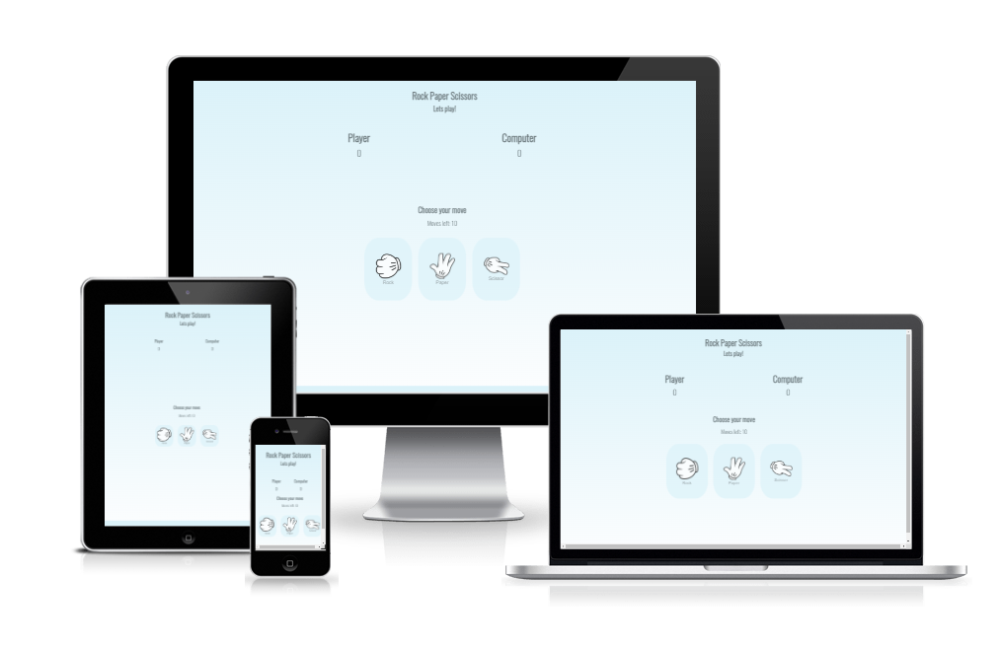
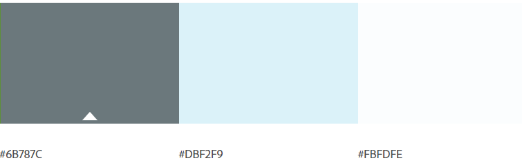
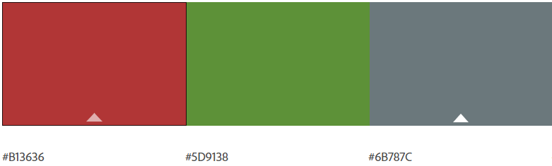
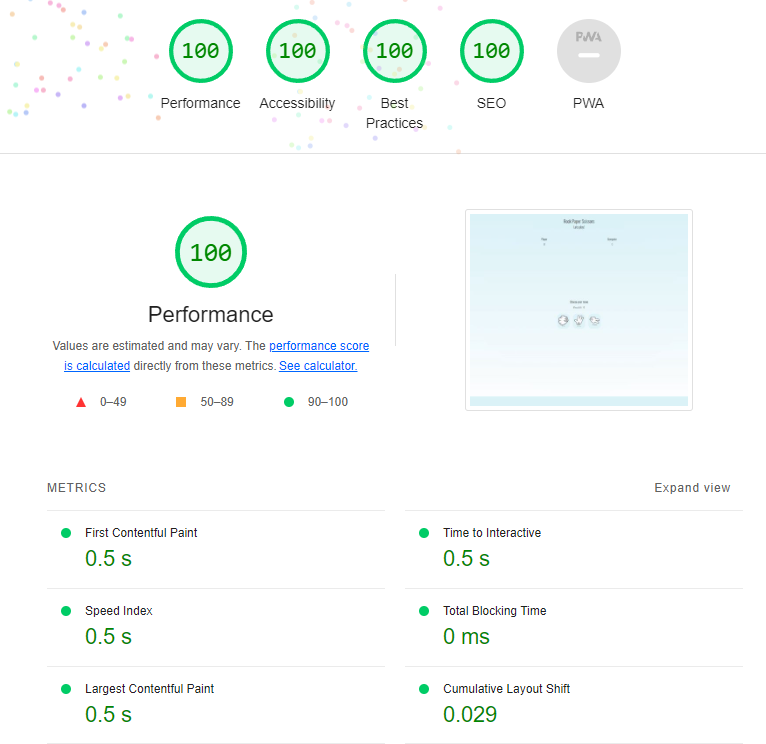

# Rock Paper Scissors

Rock Paper Scissors is a game originating from China. Its played between two people or against the computer in this case. 

<a href = "https://arneladedovic.github.io/rock-paper-scissors/" target="_blank" rel="noopener">Click here</a> to try out the game. 

## Features
Rock Paper Scissor's site is set up to be easy and quick to play.

### Existing Features

- __Header__

    * Featured at the top so the user easily can see what site they are on. 

- __Score area__

    * The score area so the player can keep track on how many points they vs the computer have. 

- __Game area__ 

    * In the game area, the player can see how many moves they have left and choose which option they want in their next step.

- __Restart game__ 

    * When the game ends by winning or losing, you can press the restart button to play again.

### Features Left To Implement

* Add an advanced Rock Paper Scissors game, to offer more options to choose.

* Add more games to the page.

* Add images so the player can see what option the computer choose. 

## Technologies Used

* Balsamiq - used to create the wireframes.
* GitHub - used to deploy the website.
* GitPod - used to edit the website.
* HTML5 - provides structure and content for the website.
* CSS - provides the styling.
* Javascript - provides the interactivity.

## Site Structure

* Rock Paper Scissors is designed to be simple to use. It has a main page and that is where the game takes place.

## Wireframes

## Design

* ### Color Scheme
    
   * The colour scheme chosen was based on a calming but playful feeling that entices the player to continue playing. 
   * The main colors were three pieces that went in the white, blue and gray direction. And then green, red and gray were used for the game results.

* ### Typography 

    * The font chosen was 'Oswald 300' for the whole page.

    * The chosen font gave the heading and the body a bold and visible text.

## Testing

* Rock Paper Scissor has been tested for validation. The codes has been run through the WC3 HTML Validator, WC3 CSS Validator, JShint. The tests images below are from HTML-Validator and CSS-Validator:

    
    

* The JSHint validator results showed that there were two semi-colons missing. This was easily fixed by adding them and now the validator is showing that there is no errors.

### Responsivness Test.

* The responsive design has been testet with <a href= "https://developer.chrome.com/docs/devtools/">Google Chrome DevTools</a> and passes all the screen sizes.

### Known Bugs

* There were two error messages due to a style link in the head section, but when you moved it to its proper location, both error messages disappeared. So problem is solved and there are no bugs left.

### LightHouse Test
* Rock Paper Scissor was also tested trough Google Lighthouse. See images below:

## Deployment

### To deploy the project:
* The site was deployed to GitHub Pages. The steps to deploy are as follows:
    * In the GitHub repository, go to the Settings tab
    * Navigate to the Pages on the left side
    * Under Source, select the branch to 'main', then click save
    * Once the 'main' branch has been selected, the page will automatically be refreshed with a detailed ribbon display to indicate the successful deployment!

The live link can be found here: https://arneladedovic.github.io/rock-paper-scissors/

### To fork the repository on GitHub:

* A copy of the repository on GitHub can be made by forking the GitHub account. The steps to fork the repository are as follows: 
    * Log in to GitHub and locate the repository: 
    * On the right side of the page is a button called 'Fork'. 
    * Click on the button to create a copy of the original repository

### To create a clone of the project:

* The steps to clone the project are as follows:
    * Under the repository, click on the code tab
    * In the 'Clone with HTTPS'-section, click on the clipboard icon to cope the given URL
    * In your IDE of choice - open Git Bash
    * Change the directory to the location where you want the cloned directory to be made
    * Type 'Git Clone' and paste the URL copy
    * Press 'enter' and the clone will be created

## Credits

* ### Inspiration 
    * Inspiration came from a great developer and youtuber: [Youtube](https://www.youtube.com/watch?v=Iwvf9iBP04M)
    * Inspiration came from a great developer and blogger: [Blogg](https://www.geeksforgeeks.org/)

* ### Content
    * The font came from: [Google Fonts](https://fonts.google.com/)
    * The color palette was created on: [Adobe Color](https://color.adobe.com/sv/create/color-wheel) 
    * The icons came from: [Font Awesome](https://fontawesome.com/)

* ### Media
    * The Button-photos used on the page came from: [Clipartmax](https://www.clipartmax.com/so/rock-paper-scissors-clipart/)

## Acknowledgements
Rock Paper Scissor was completed as a Porfolio 3 Project for the Full Stack Software Developer education at the [Code Institute](https://codeinstitute.net/). I would like to thank the Slack Community, Code Institute and the great Youtube and Google for the inspiration, help and support during this project. 

### **Arnela Dedovic, 2022.**